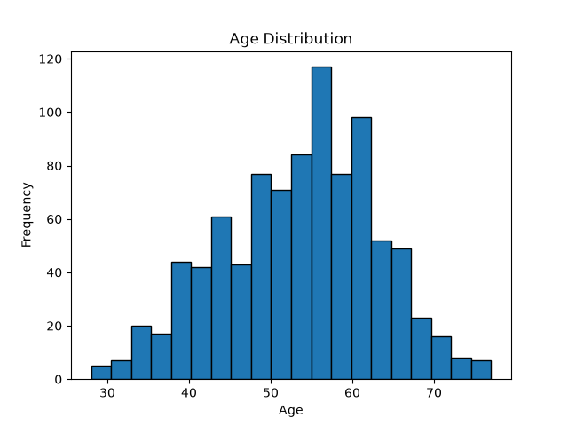
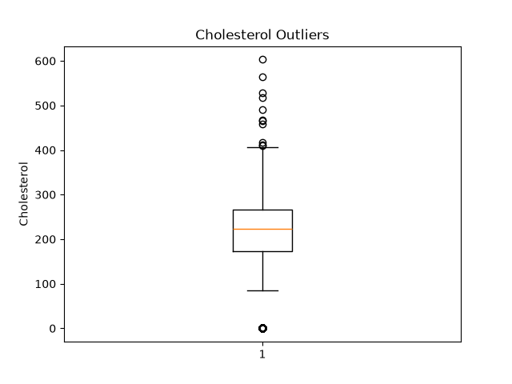
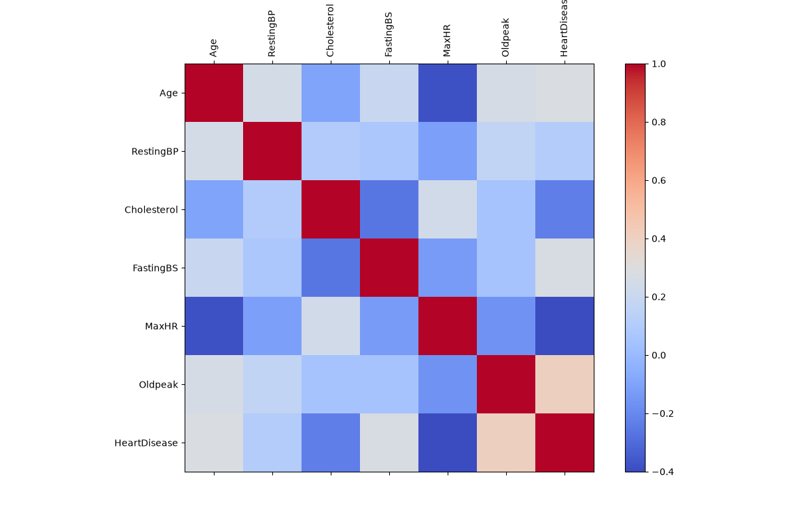
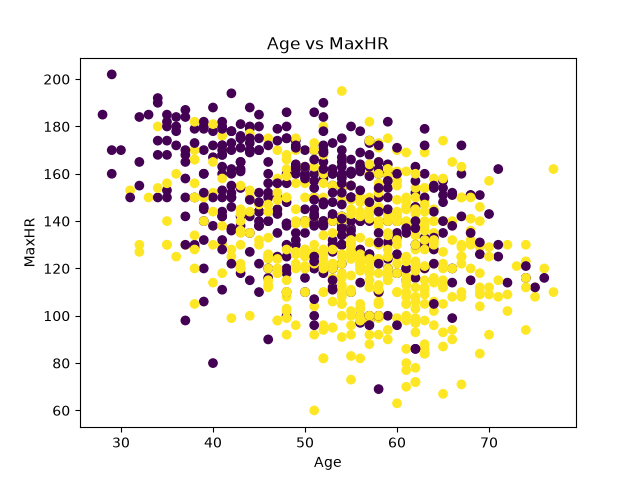
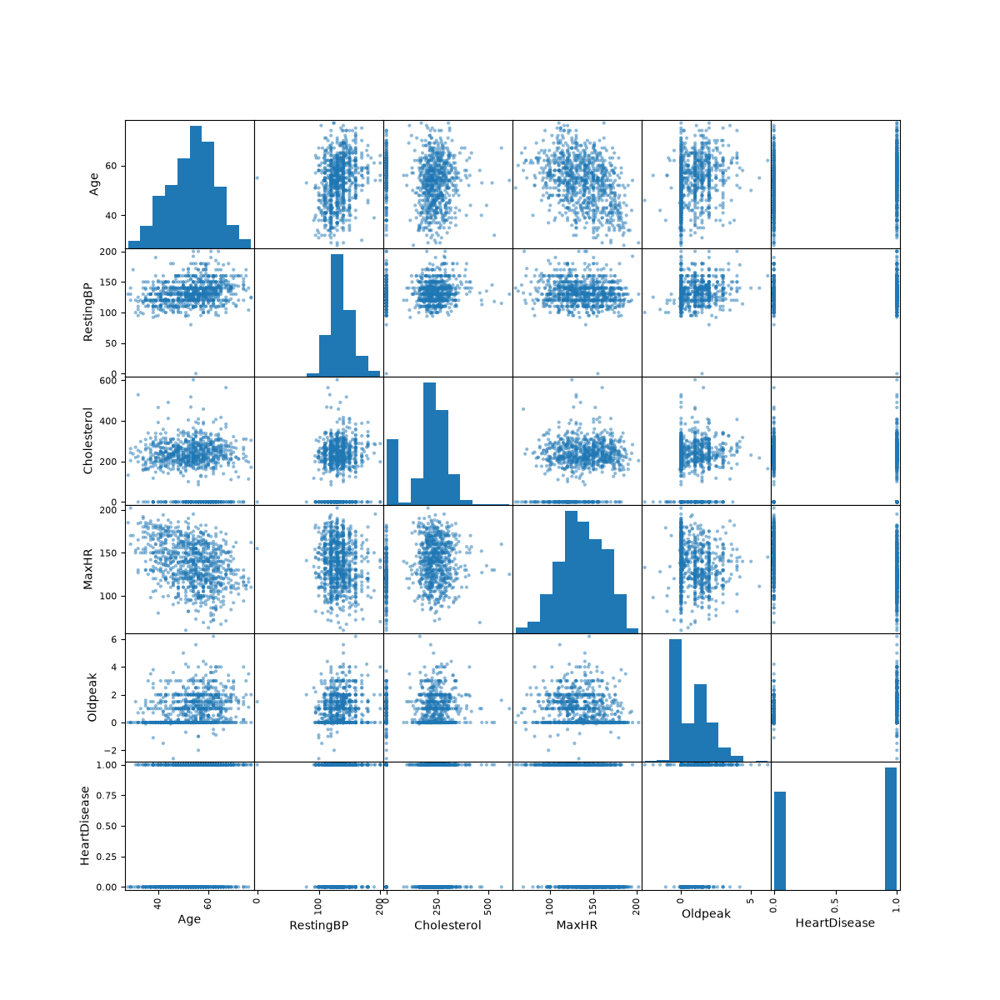

# Analystlab-africa-week2datascience
Heart Disease Prediction &amp; Data Preprocessing
[Onndwel.ipynb]
# Analystlab-africa-week2datascience
Heart Disease Prediction & Data Preprocessing

## 📊 Visualizations

### Age Distribution

### Cholesterol Outliers

### Correlation Heatmap

### Age vs MaxHR

### Scatter Matrix

# 🫀 Heart Disease Prediction – Feature Engineering & Data Preprocessing  
AnalystLab Africa | Data Science Internship | Week 2

## 📌 Project Overview
This project prepares the Heart Disease Prediction dataset for machine learning by performing comprehensive feature engineering and data preprocessing.  
The goal is to transform raw clinical data into a clean, encoded, scaled, and feature-selected dataset ready for predictive modelling.

**Prediction Task:** Binary classification — predict whether a patient is likely to develop heart disease.
